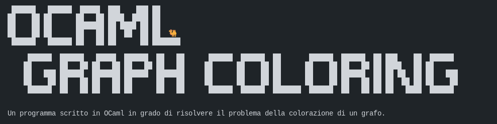

## Installazione

Prerequisiti:
- OCaml (con anche ocamlc)
- Python 3.x
    - pyvis (`pip install pyvis`)

Per compilare il progetto eseguire i seguenti comandi:

```bash
cd progetto
make
```

E' possibile ripulire dall'esecuzione di `make` con: `make clear`.

## Esecuzione

Per avviare il progetto compilato eseguire i seguenti comandi dopo averlo compilato:

```
cd bin
./exe
```

**N.B.**: *E' richiesto che il terminale sui cui viene eseguito supporti la visualizzazione delle emoji !!*